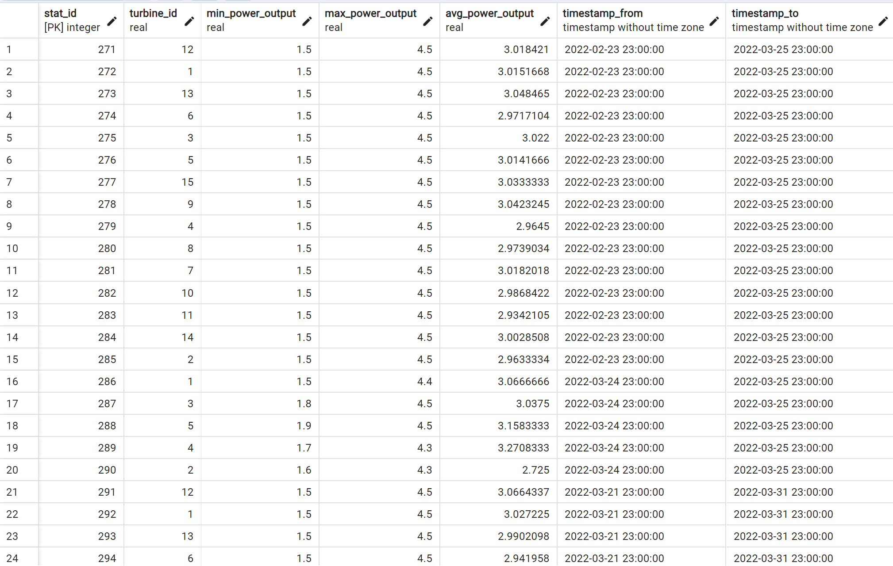
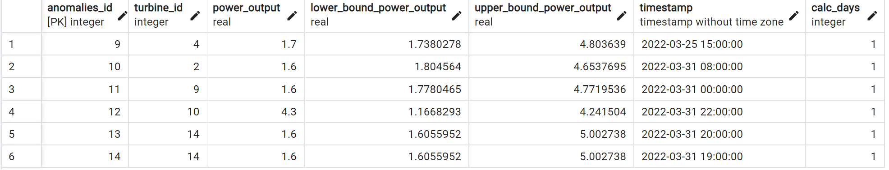
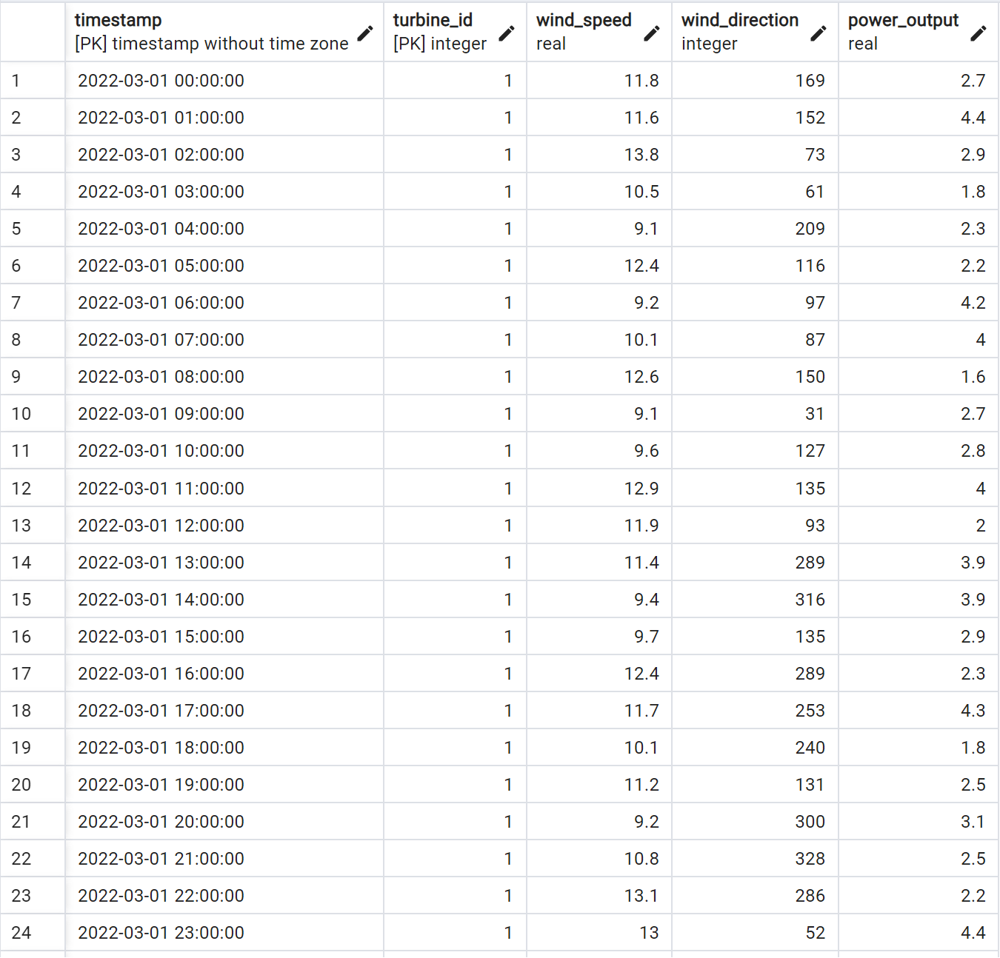
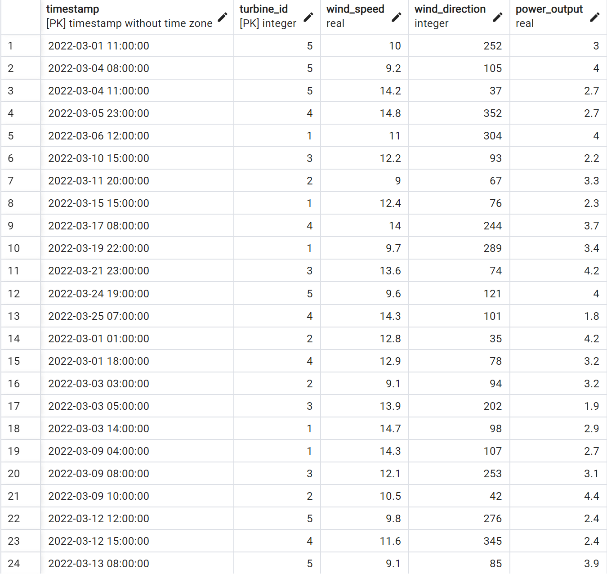

# Wind Turbine Pipeline

This pipeline is implemented in Python, leveraging PySpark's powerful distributed computing capabilities.

## Key Components

1. Data Ingestion:
   - The pipeline reads data from CSV files, with each file corresponding to a group of turbines.
   - The files are updated daily and include data for the last 24 hours.
2. Data Cleaning:
   - Handling Missing Values: The fill_nas_with_mean function imputes missing values using the mean of the nearest non-null values within each turbine's data.
   - Outlier Detection and Replacement: The replace_outliers_with_mean function identifies and replaces outliers (defined as values more than 2 standard deviations from the mean) with the mean of the column.
3. Data Processing:
   - Summary Statistics: The calculate_stats function computes daily mean, minimum, and maximum power output for each turbine.
   - Anomaly Detection: The detect_anomalies function identifies significant deviations in power output using the 2-sigma rule.
4. Data Storage:
   - Processed data is uploaded to a PostgreSQL database using the upload_data_to_sql function for long-term storage and analysis.
5. Logging and Monitoring:
   - The solution includes a logging mechanism to track the process and record any issues encountered during execution.

## Assumptions

1. Data Format and Consistency: It is assumed that the CSV files have a consistent format and contain the required columns for all turbines.
2. Data Completeness: While the system may miss some entries, it is assumed that the provided data is largely complete and representative of the turbine outputs.
3. Outlier Definition: Outliers are defined based on standard deviation, which assumes a normal distribution of data. This might not hold true in all cases.
4. Database Accessibility: The script assumes uninterrupted access to the PostgreSQL database with sufficient permissions for data operations.
5. System Resources: Adequate system resources (memory, CPU) are available for Spark to process the data efficiently, considering the potential for data volume growth.

## Scalability and Performance

- The pipeline is designed to handle increases in data volume through Spark's distributed processing capabilities.
- Partitioning strategies and Spark configurations may need tuning based on the actual data volume and infrastructure.

### Runs with the following command

```console
spark-submit --conf "spark.pyspark.python=C:/project/pyspark/venv/Scripts/python.exe" --jars file:///c:/project/pyspark/jdbc_driver/postgresql-42.7.1.jar file:///c:/project/pyspark/main.py
```

## Screenshots from Database

#### 'summary_statistics' Table



#### 'anomalies' Table



#### 'turbine_data_cleaned' Table



#### 'turbine_data_raw' Table


